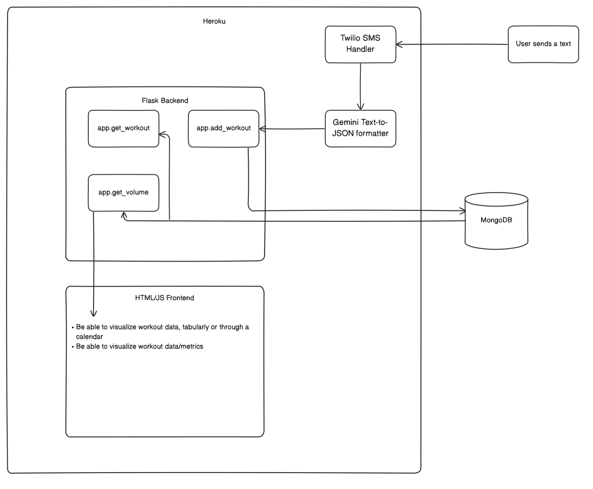

Web application that tracks your workouts and progress. You can check it out [here](https://floating-beyond-47078-ff2ad837c838.herokuapp.com).

I developed a web-app which tracks your workouts and workout programs. This was my first app-development project. I recently rebuilt and redeployed it, because several previous deployements failed. 

The basic functionality of the app is that I should be able to update my workouts from my phone, and I should be able to see my progress from a website. The functionality I decided was utilizing a messaging service, where I can send an SMS message, and it will update the DB, in turn updating the web app.

I also included a small visualization tool that is able to display the **volume**, or the sum of all the reps * sets in a split. Usually, progress is indicated when this number goes up. With some incremental preogressive overload, this strategy usually works pretty well for me.

Here's a nice picture of the system that I designed. I used Heroku to hosy my app (would highly recommend. Looking at logs, debugging, and setting up is much less of a hassle than PythonAnywhere). I used Twilio as my SMS service, and I build the backend using Flask, and the front end using 1 html file, with some JS and CSS for styling and connecting the backend.

A funny story about this project is that I tried to build this thing after just completing my intro to prograaming course at UC Berkeley (CS61A). I followed a bunch fo YouTube tutorials and sat and coded the ugliest app ever, and the entire process took 4 weeks (my entire winter break)

Now, with a lot more experience under my belt, I rebuilt this app from scratch, redid the system design, and deployed the app successfully in less than 2 days. This was a fun little project, and I am excited for the many more to come.

Feel free to see how I built this app [here](https://github.com/pranavramachandra1/workout_webapp) Thanks for stopping by lol

###### Languages: Python, JS, HTML, CSS
###### Relevant Libraries: Flask, MySQL, sqlalchemy, Pandas